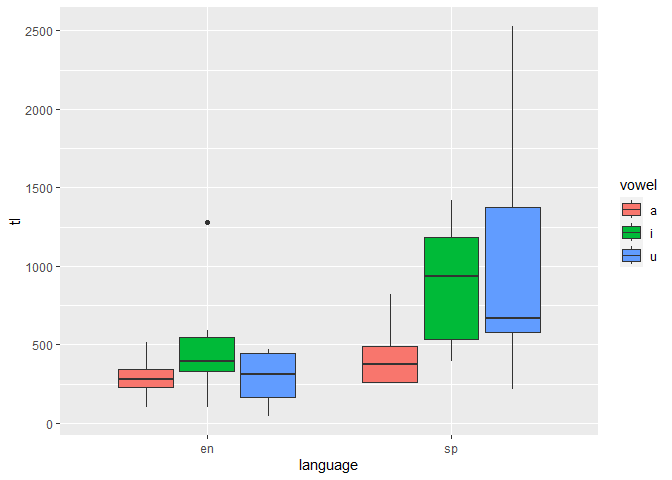
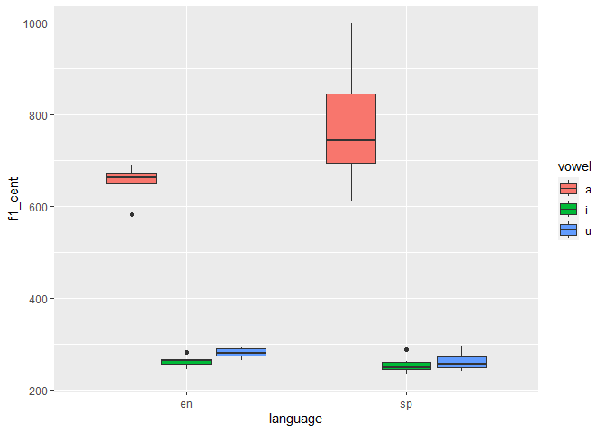
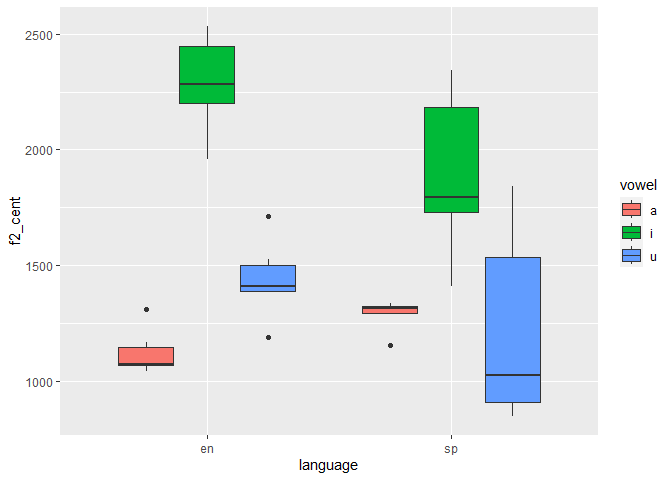

# README

a\. This small segment of code is assigning values to the variables
“vonset” and “voffset”, and the value is derived from the specified
points in the textgrid. It is then getting different duration values,
first the baseline durationV by subtracting onset from offset, then
percentile duration values for the 20%, 35%, 50%, 65%, and 80% duration
points.

b\. The first section of the script is choosing where to save the output
of the script, creating the empty .csv file, creating new columns for
the F1 and F2 values at different percentages. Then it is opening the
stim folder and accessing the data, selecting the .wav file and
textgrid. It runs a loop the set defaults and check intervals, then
assigns an identifier to the data, in my case “akr”, to show whose data
it is. Then it actually extracts all of the measurements and assigns
them to the proper variables, as seen in my answer above. Finally it
saves everything it just did and outputs it in the .csv file as well as
a Praat window, then cleans the original Praat window.

c\. This week because there was filler content around the interest
areas, and there was far more content to segment, I had to adapt new
ways to navigate the textgrid. Additionally, rather than finding vowel
midpoints we were finding full vowel durations inside of words in
multiple languages, so I had to learn to differentiate (at least a
somewhat) between different types of sounds in the spectrogram.

``` r
library(tidyverse)
```

    ── Attaching core tidyverse packages ──────────────────────── tidyverse 2.0.0 ──
    ✔ dplyr     1.1.4     ✔ readr     2.1.5
    ✔ forcats   1.0.0     ✔ stringr   1.5.1
    ✔ ggplot2   3.4.4     ✔ tibble    3.2.1
    ✔ lubridate 1.9.3     ✔ tidyr     1.3.1
    ✔ purrr     1.0.2     
    ── Conflicts ────────────────────────────────────────── tidyverse_conflicts() ──
    ✖ dplyr::filter() masks stats::filter()
    ✖ dplyr::lag()    masks stats::lag()
    ℹ Use the conflicted package (<http://conflicted.r-lib.org/>) to force all conflicts to become errors

``` r
library(stringr)
library(dplyr)
```

``` r
dat <- read_csv( "./data/vowel_data.csv")
```

    Rows: 36 Columns: 17
    ── Column specification ────────────────────────────────────────────────────────
    Delimiter: ","
    chr  (4): id, item, vowel, language
    dbl (13): f1_cent, f2_cent, tl, f1_20, f1_35, f1_50, f1_65, f1_80, f2_20, f2...

    ℹ Use `spec()` to retrieve the full column specification for this data.
    ℹ Specify the column types or set `show_col_types = FALSE` to quiet this message.

``` r
glimpse(dat)
```

    Rows: 36
    Columns: 17
    $ id       <chr> "akr", "akr", "akr", "akr", "akr", "akr", "akr", "akr", "akr"…
    $ item     <chr> "meet", "beat", "feet", "seat", "heat", "fleet", "moss", "bot…
    $ vowel    <chr> "i", "i", "i", "i", "i", "i", "a", "a", "a", "a", "a", "a", "…
    $ language <chr> "en", "en", "en", "en", "en", "en", "en", "en", "en", "en", "…
    $ f1_cent  <dbl> 262.84, 245.30, 253.93, 265.86, 282.08, 266.67, 581.40, 689.2…
    $ f2_cent  <dbl> 2531.51, 2492.61, 1959.19, 2249.43, 2184.62, 2315.48, 1068.84…
    $ tl       <dbl> 103.38, 308.88, 395.91, 594.23, 1280.90, 394.63, 352.67, 517.…
    $ f1_20    <dbl> 266.46, 234.68, 240.96, 269.41, 253.19, 295.74, 521.65, 729.3…
    $ f1_35    <dbl> 262.58, 243.13, 236.74, 269.19, 271.66, 261.35, 521.68, 815.9…
    $ f1_50    <dbl> 252.21, 255.45, 239.52, 266.25, 284.57, 259.13, 542.22, 780.3…
    $ f1_65    <dbl> 261.86, 256.47, 278.53, 253.52, 296.07, 261.30, 607.42, 606.3…
    $ f1_80    <dbl> 271.08, 236.75, 273.90, 270.94, 304.89, 255.83, 714.03, 514.3…
    $ f2_20    <dbl> 2504.70, 2452.17, 1978.53, 2347.08, 2461.72, 2072.74, 958.05,…
    $ f2_35    <dbl> 2498.27, 2490.66, 2095.40, 2404.88, 2428.95, 2263.92, 988.28,…
    $ f2_50    <dbl> 2537.07, 2586.62, 2001.21, 2408.65, 2466.52, 2362.37, 1030.91…
    $ f2_65    <dbl> 2536.20, 2517.78, 1897.12, 2208.69, 1609.68, 2414.45, 1121.52…
    $ f2_80    <dbl> 2581.29, 2415.80, 1823.69, 1877.87, 1956.22, 2463.93, 1245.47…

``` r
dat %>%
  summarize(f2m = mean(f2_cent),f1m = mean(f1_cent),tlm = mean(tl), f2sd = sd(f2_cent), f1sd = sd(f1_cent), tlsd = sd(tl)) 
```

    # A tibble: 1 × 6
        f2m   f1m   tlm  f2sd  f1sd  tlsd
      <dbl> <dbl> <dbl> <dbl> <dbl> <dbl>
    1 1543.  415.  576.  485.  225.  505.

``` r
dat %>%
  ggplot() +
  aes(x = language, y = tl, fill = vowel) +
geom_boxplot()
```



``` r
dat %>%
  ggplot() +
  aes(x = language, y = f1_cent, fill = vowel) +
geom_boxplot()
```



``` r
dat %>%
  ggplot() +
  aes(x = language, y = f2_cent, fill = vowel) +
geom_boxplot()
```


